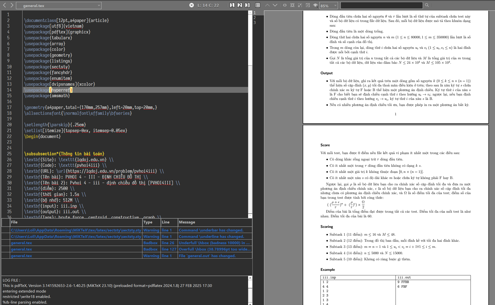

<br/>
<p align="center">
  <a href="https://github.com/Legend0fHell/dmoj-statement-converter">
  </a>
  <h3 align="center">Accepted</h3>

  <p align="center">
    Bộ công cụ hỗ trợ làm việc với những bài toán Lập trình thi đấu.
    <br/>
    <br/>
    <a href="https://github.com/Legend0fHell/dmoj-statement-converter/releases"></a>
  </p>
</p>

## Tính năng
1. Định dạng test
- Chuyển cấu trúc Test từ định dạng các folder (Themis) sang định dạng file ZIP (DMOJ, Polygon, ...)


- Chuyển cấu trúc Test từ định dạng file ZIP về lại định dạng các folder


- Có thể tự ý tùy chỉnh đuôi file đầu ra, có chứa input hay output, tên bài đầu ra...
- Có thể sử dụng file sinh kết quả để sinh ra output dựa trên input (sắp ra mắt).

2. Cào bài
- Cào bài và định dạng đề bài từ **27+ trang OJ khác nhau** (danh sách phía dưới).
- Tự động nhận diện test mẫu, tham số đề bài (giới hạn thời gian, file nhập/xuất, ...).
- Tự động lưu ảnh/PDF trong đề.
- Định dạng đề bài về 5 kiểu đầu ra:
    1. Markdown thuần;
    2. Markdown cho DMOJ;
    3. LaTeX thuần;
    4. LaTeX cho Polygon;
    5. LaTeX theo mẫu.
- Tự động lưu file Test của đề (nếu có).




## Danh sách OJ hỗ trợ
1. Dạng DMOJ/VNOJ:
dmoj.ca
cyboj.ddns.net
oj.qnoi.info
oj.vnoi.info
tinhoctre.vn
coder.husc.edu.vn
oj.chuyenhalong.edu.vn
dmoj.ctu.edu.vn
hnoj.edu.vn
chvoj.edu.vn
oj.giftedbat.edu.vn
claoj.edu.vn
laptrinhonline.club
ptnkoj.com
laptrinh.ictu.edu.vn
oj.lequydon.net
oj.thptchuyenhatinh.edu.vn
sqrtoj.edu.vn
oj.vku.udn.vn
oj.eiu.edu.vn
"""

2. Dạng LQDOJ:
```
lqdoj.edu.vn
tleoj.edu.vn
nbk.homes
ltoj.edu.vn
quangtrioj.edu.vn
```

3. Dạng Codeforces:

```
*.codeforces.com
*.contest.codeforces.com
codeforces.com/gym/*
codeforces.com/problemset/*
```

4. Dạng CSLOJ:
```
csloj.ddns.net
```

## Build guide/Hướng dẫn build
WIP